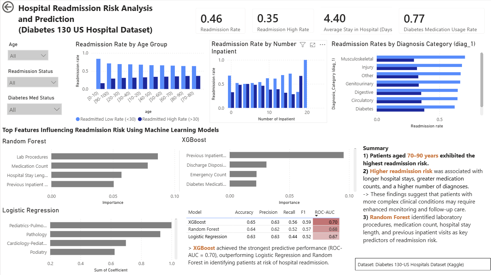

# Hospital Readmission Risk Analysis and Prediction

## Project Overview

Hospital readmissions place a significant burden on healthcare systems and are associated with increased healthcare costs and poorer patient outcomes.

This project analyses hospital readmission patterns using the **Diabetes 130-US Hospitals Dataset** and develops machine learning models to identify patients at higher risk of readmission. The project combines data analysis, predictive modelling, and interactive visualisation using Power BI.

---

## Key Results

- Higher readmission risk was observed among older patients (70-90 years) and patients with longer hospital stays, more diagnoses, and greater medication use.
- Previous inpatient visits were among the strongest predictors of future readmission.
- XGBoost achieved the strongest overall predictive performance, with an ROC-AUC of 0.70 and accuracy of 0.65.
- The analysis demonstrates how patient and clinical characteristics can be integrated into a machine-learning workflow for hospital readmission risk prediction.

---

## Dashboard

The Power BI dashboard summarises readmission KPIs, readmission by age group, readmission by diagnosis category, readmission by previous inpatient visits, feature importance comparison, machine learning model comparison, and interactive slicers.



---

## Business Problem

Hospital readmissions are an important quality indicator in healthcare.

The objective of this project is to:

- Identify factors associated with hospital readmission.
- Predict patient readmission risk using different machine learning models.
- Present findings through an interactive Power BI dashboard.
- Support evidence-based decision making for healthcare providers.

---

## Dataset

**Dataset:** Diabetes 130-US Hospitals Dataset

Source:
https://www.kaggle.com/datasets/brandao/diabetes

The dataset contains over 100,000 hospital admissions for diabetic patients and includes:

- Patient demographics
- Admission information
- Diagnoses
- Medications
- Laboratory procedures
- Length of hospital stay
- Readmission status

Target Variable for machine-learning analysis, the original readmission outcome was converted to a binary variable:
- NO : Not readmitted
- <30 → Readmitted
- >30 → Readmitted

The models therefore predict whether a patient encounter is associated with subsequent readmission, regardless of whether readmission occurred within or after 30 days.

---

## Tools and Technologies

- Python
- Pandas
- NumPy
- Matplotlib
- Seaborn
- Scikit-learn
- XGBoost
- SQLite (sqlite3)
- SQL 
- Power BI
- Jupyter Notebook

---

## Project Workflow

1. Data cleaning
2. Exploratory Data Analysis (EDA)
3. SQL business analysis
4. Feature engineering
5. Machine learning modelling
    - Logistic Regression
    - Random Forest
    - XGBoost
6. Model evaluation
7. Interactive Power BI dashboard

---

## Machine Learning Results

Three machine learning models were evaluated.

| Model | Accuracy | Precision | Recall | F1 Score | ROC-AUC |
|--------|---------:|----------:|--------:|----------:|---------:|
| Logistic Regression | 0.63 | 0.63 | 0.44 | 0.52 | 0.67 |
| Random Forest | 0.64 | 0.62 | 0.52 | 0.57 | 0.68 |
| XGBoost | **0.65** | **0.63** | **0.56** | **0.59** | **0.70** |


XGBoost achieved the strongest overall performance among the three evaluated models, with the highest accuracy, recall, F1-score and ROC-AUC. Random Forest showed intermediate performance, while Logistic Regression provided a useful baseline.

Although XGBoost performed best, the moderate ROC-AUC indicates that hospital readmission remains a challenging prediction problem and that the available clinical and demographic features seemed to provide only partial discrimination between patients with different readmission outcomes.

---


## Repository Structure

Hospital-Readmission-Risk/
│
├── data/            — Dataset and processed data
├── notebooks/       — Python analysis and machine-learning modelling
├── notebooks_sql/   — SQL analysis and database
├── powerbi/         — Power BI dashboard and visualisations
├── requirements.txt — Python dependencies
└── README.md        — Project documentation

```

## How to Run

1. Clone or download this repository.
2. Install the required Python packages (requirements.txt)
3. Open the notebook in `notebooks/` using Jupyter Notebook or JupyterLab.
4. Run the notebook to reproduce the data analysis and machine-learning workflow.
5. SQL analyses are available in `notebooks_sql/`.
6. Power BI dashboard files are available in `powerbi/`.

---

## Skills Demonstrated
- Data cleaning and preprocessing with Python and pandas
- Exploratory data analysis of healthcare data
- SQL querying and aggregation
- Feature engineering for predictive modelling
- Classification using Logistic Regression, Random Forest, and XGBoost
- Model evaluation using accuracy, precision, recall, F1-score, and ROC-AUC
- Feature-importance analysis
- Power BI dashboard development
- Interpretation and communication of predictive modelling results
